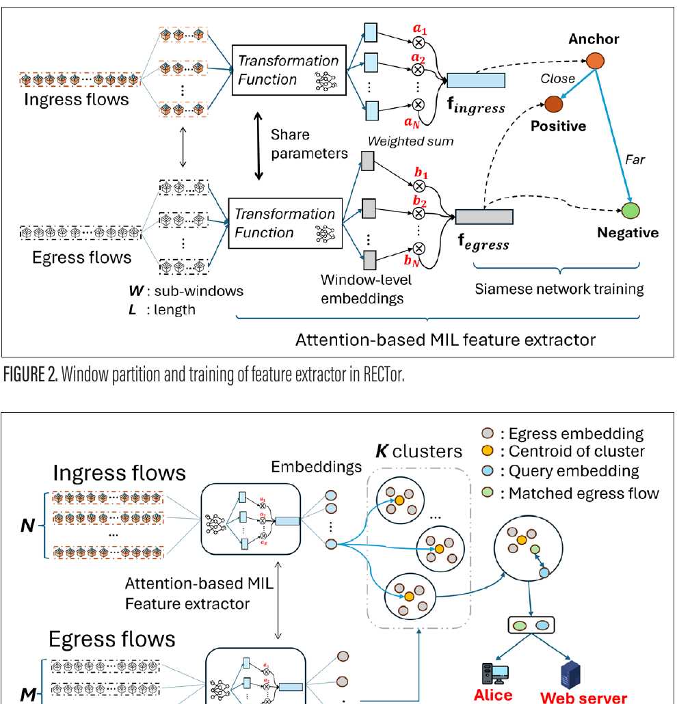
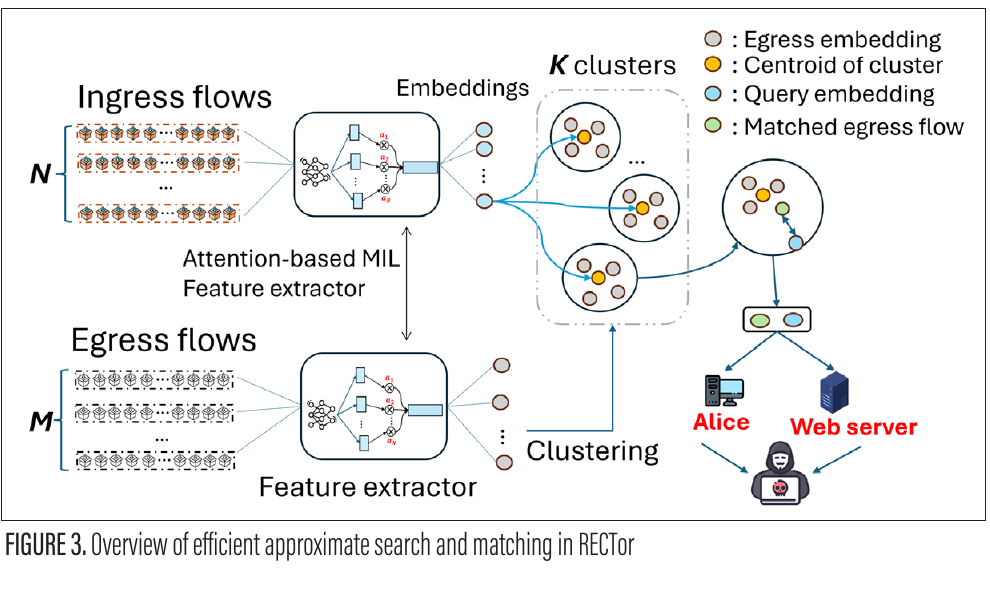

# RECTor: Robust and Efficient Correlation Attack on Tor

[](https://www.python.org/)
[](https://pytorch.org/)
[](https://doi.org/10.1109/MCOM.001.2500251)

Official research code for **RECTor**, a noise-resilient and scalable framework for
correlating traffic observed at Tor entry and exit vantage points. RECTor represents a
flow as multiple temporal windows, learns a shared embedding with attention-based
multiple-instance learning (MIL), and narrows matching with approximate search.

> **Ethical use.** Traffic correlation can undermine anonymity. This repository is
> intended for reproducible privacy research, controlled experiments, and the design of
> stronger defenses. Do not monitor traffic without authorization.

## Method at a glance

RECTor separates the pipeline into three explicit stages:

1. **Windowed preprocessing.** Packet size and inter-arrival-time features are extracted
   from short windows, so missing traffic affects only part of a flow representation.
2. **Robust representation learning.** A shared GRU encodes each window; learned attention
   weights combine the useful windows. A Siamese triplet objective pulls corresponding
   ingress/egress flows together and pushes unrelated flows apart.
3. **Efficient matching.** Candidate search is restricted in embedding space instead of
   exhaustively comparing every ingress-egress pair.



*Figure 2 from the RECTor paper: window partitioning, attention-based MIL, and Siamese
training.*



*Figure 3 from the RECTor paper: embedding-space candidate search and matching.*

## Repository layout

```text
RECTor-main/
├── configs/default.yaml       # documented reference hyperparameters
├── data/README.md             # expected raw/processed data layout
├── docs/assets/               # paper figures used by this README
├── src/rector/
│   ├── cli.py                 # `rector` command-line entry point
│   ├── data.py                # parsing, windowing, normalization, padding
│   ├── matching.py            # distances, assignment, TPR/FPR metrics
│   └── models.py              # 2-layer GRU + attention MIL encoder
├── tests/                     # fast unit tests for data and matching logic
├── Step*.py                   # archived prototype scripts (see note below)
├── CITATION.cff
└── pyproject.toml
```

The importable implementation under `src/rector` is the maintained interface. The five
root-level `Step*.py` files are retained to preserve the originally released prototype;
they contain machine-specific paths and should be treated as historical reference.

## Installation

Create an isolated environment and install the package in editable mode:

```bash
python -m venv .venv
source .venv/bin/activate              # Windows: .venv\Scripts\activate
python -m pip install --upgrade pip
python -m pip install -e ".[dev]"
```

PyTorch installation can be platform-specific. If CUDA is required, install the matching
build from the [official PyTorch selector](https://pytorch.org/get-started/locally/)
before installing RECTor.

## Data preparation

Download the [DeepCOFFEA dataset](https://drive.google.com/file/d/1ZYFXfESD15SAR4Q8hsoVYdTHpTD8Orys/view?usp=sharing)
and arrange a split as documented in [`data/README.md`](data/README.md). Each trace name
must be shared between `inflow/` and `outflow/`; each line is
`timestamp<TAB>packet_size`.

Create a text file containing one eligible trace name per line, then generate windows:

```bash
rector prepare \
  --data-dir data/raw/train \
  --file-list data/splits/train.txt \
  --output-dir data/processed/train \
  --window-seconds 5 \
  --stride-seconds 2 \
  --num-windows 11
```

The command is cross-platform and emits files named
`5_win<index>_addn2_superpkt.pickle`. Dataset files, model checkpoints, and generated
results are ignored by Git to keep the repository lightweight.

## Reproducibility notes

- The paper describes non-overlapping 5-second windows for its main evaluation. The
  released prototype defaults to 11 windows with a 2-second stride. Both values are
  exposed as CLI arguments; record the selected setting with every result.
- Ground-truth metrics assume corresponding ingress and egress samples share the same
  order (the diagonal of the distance matrix). Validate label alignment before scoring.
- The paper's large-scale candidate stage uses approximate nearest-neighbor search. The
  included `one_to_one_mapping` utility uses exact Hungarian assignment for small-scale
  analysis and is not a substitute for the paper's ANN scalability experiment.
- Checkpoints and the full experiment dataset are not bundled. Therefore this repository
  validates the pipeline and model components, but cannot reproduce headline numbers
  until those artifacts are supplied.

Run the test suite before an experiment:

```bash
pytest -q
```

## Citation

```bibtex
@article{wu2026rector,
  title   = {RECTor: Robust and Efficient Correlation Attack on Tor},
  author  = {Wu, Binghui and Mon Divakaran, Dinil and Csikor, Levente and Gurusamy, Mohan},
  journal = {IEEE Communications Magazine},
  year    = {2026},
  doi     = {10.1109/MCOM.001.2500251}
}
```

The bibliographic metadata is also available in [`CITATION.cff`](CITATION.cff).

## License

No software license was included in the original release. Until the authors add one, the
code should be treated as **all rights reserved**; public visibility alone does not grant
permission to copy, modify, or redistribute it.
